# Análisis y Especificación de Requerimientos

## BotaBien

*Clasificación de residuos por visión artificial en el dispositivo*

**Versión 1,0** · 06/08/2026 · Juan Urrego

> [!NOTE]
> Esta es la **vista en Markdown** del documento, legible directamente en GitHub.
> El documento oficial con el formato de entrega es [`F_Analisis_de_Requerimientos_V1,0_BotaBien.docx`](F_Analisis_de_Requerimientos_V1%2C0_BotaBien.docx) — GitHub no puede previsualizar archivos de Word, así que ese enlace lo descarga.
> Ambos se generan desde la misma fuente de datos (`tools/gen_doc_data.py`), de modo que no pueden divergir.

---

## Tabla de contenido

- [1. Equipo del Proyecto](#1-equipo-del-proyecto)
- [2. Control de Versiones](#2-control-de-versiones)
- [3. Definiciones, Siglas y Abreviaturas](#3-definiciones-siglas-y-abreviaturas)
  - [3.1 Justificación de la necesidad](#31-justificación-de-la-necesidad)
- [4. Documentación relacionada](#4-documentación-relacionada)
- [5. Diagrama flujo de actividades del proceso](#5-diagrama-flujo-de-actividades-del-proceso)
- [6. Casos de Uso](#6-casos-de-uso)
  - [6.1.1 CUS-001: Configurar país y perfil de clasificación](#611-cus-001-configurar-país-y-perfil-de-clasificación)
  - [6.1.2 CUS-002: Escanear y registrar las canecas disponibles](#612-cus-002-escanear-y-registrar-las-canecas-disponibles)
  - [6.1.3 CUS-003: Clasificar un residuo mediante la cámara](#613-cus-003-clasificar-un-residuo-mediante-la-cámara)
  - [6.1.4 CUS-004: Asistir la captura ante condiciones adversas](#614-cus-004-asistir-la-captura-ante-condiciones-adversas)
  - [6.1.5 CUS-005: Detectar contaminación en residuos aprovechables](#615-cus-005-detectar-contaminación-en-residuos-aprovechables)
  - [6.1.6 CUS-006: Gestionar resultados de baja confianza](#616-cus-006-gestionar-resultados-de-baja-confianza)
  - [6.1.7 CUS-007: Consultar la justificación normativa del resultado](#617-cus-007-consultar-la-justificación-normativa-del-resultado)
  - [6.1.8 CUS-008: Ajustar capacidades según la gama del dispositivo](#618-cus-008-ajustar-capacidades-según-la-gama-del-dispositivo)
  - [6.1.9 CUS-009: Consultar el historial local de clasificaciones](#619-cus-009-consultar-el-historial-local-de-clasificaciones)
  - [6.1.10 CUS-010: Iniciar sesión — módulo preparado para versión futura](#6110-cus-010-iniciar-sesión-módulo-preparado-para-versión-futura)
- [7. Requerimientos](#7-requerimientos)
  - [7.1 Requerimientos funcionales](#71-requerimientos-funcionales)
    - [7.1.1 Lista de requerimientos funcionales](#711-lista-de-requerimientos-funcionales)
    - [7.1.2 Especificación de requerimientos funcionales](#712-especificación-de-requerimientos-funcionales)
  - [7.2 Requerimientos No Funcionales](#72-requerimientos-no-funcionales)
- [8. Matriz de trazabilidad de Requerimientos vs Casos de uso](#8-matriz-de-trazabilidad-de-requerimientos-vs-casos-de-uso)
- [9. Observaciones adicionales](#9-observaciones-adicionales)
- [10. Control de revisión y aprobaciones del documento y sus anexos](#10-control-de-revisión-y-aprobaciones-del-documento-y-sus-anexos)

---

## 1. Equipo del Proyecto

| Rol | Persona asignada |
|---|---|
| Gestor de Proyectos | Juan Urrego |
| Analista de requerimientos | Juan Urrego |
| Arquitecto de software | Juan Urrego |
| Programadores / Desarrolladores | Agentes de IA en ejecución paralela, dirigidos por Juan Urrego |
| Ingeniero de aprendizaje automático | Agente ML, dirigido por Juan Urrego |
| Tester / QA | Agente QA, dirigido por Juan Urrego |
| Responsable de revisión y aprobación | Juan Urrego |

## 2. Control de Versiones

| Fecha | Versión | Descripción | Responsable de la versión |
|---|---|---|---|
| 06/08/2026 | 1,0 | Creación de documento de requerimientos | Juan Urrego |

## 3. Definiciones, Siglas y Abreviaturas

- **CNN (Red Neuronal Convolucional):** arquitectura de red neuronal especializada en el análisis de imágenes, base de la clasificación visual de residuos de este proyecto.
- **Inferencia en el dispositivo (on-device):** ejecución del modelo de aprendizaje automático en el propio teléfono, sin enviar datos a un servidor.
- **LiteRT:** motor de ejecución de modelos de aprendizaje automático en dispositivos móviles, sucesor de TensorFlow Lite.
- **Cuantización INT8:** técnica que reduce la precisión numérica de un modelo a enteros de 8 bits para acelerarlo y reducir su tamaño, con una pérdida mínima de exactitud.
- **Delegado de aceleración:** componente que traslada el cálculo del modelo a hardware especializado del dispositivo, como la GPU o la NPU.
- **NNAPI (Neural Networks API):** interfaz de Android que permite a las aplicaciones aprovechar los aceleradores de aprendizaje automático del dispositivo.
- **Gama del dispositivo (tier):** clasificación en baja, media o alta que la aplicación asigna al teléfono según su capacidad real de cómputo, y que determina qué funciones se habilitan.
- **Perfil normativo:** archivo de datos que declara, para un país concreto, las canecas existentes, sus colores y las reglas que asignan cada material a una caneca.
- **Ruta de disposición:** destino final del residuo con independencia del color de la caneca: aprovechable, no aprovechable, orgánico, peligroso o recolección especial.
- **Motor de reglas:** componente que traduce el material identificado por el modelo a una caneca concreta, aplicando el perfil normativo activo.
- **Contaminación de un reciclable:** presencia de residuo de alimento, líquido o grasa que impide que un material aprovechable pueda reciclarse, obligando a enviarlo a la caneca de no aprovechables.
- **Resolución 2184 de 2019:** norma colombiana que unifica el código de colores para la separación de residuos en la fuente en blanco, negro y verde, vigente desde el 1 de enero de 2021.
- **KMP (Kotlin Multiplatform):** tecnología que permite compartir un mismo código de lógica de negocio entre Android e iOS.
- **Puerto (port):** interfaz declarada en la capa de dominio que abstrae una capacidad de plataforma y permite implementarla de forma distinta en cada sistema operativo.
- **Augmentación de datos:** generación de variantes artificiales de las imágenes de entrenamiento para que el modelo tolere condiciones reales adversas.
- **Contaminación sintética:** generación artificial de imágenes de reciclables sucios a partir de imágenes de reciclables limpios, ante la inexistencia de conjuntos de datos públicos de este tipo.
- **CUS (Caso de Uso):** interacción completa entre un actor y el sistema.
- **RF (Requerimiento Funcional):** capacidad concreta y verificable que ofrece el sistema.
- **RNF (Requerimiento No Funcional):** restricción de calidad que el sistema debe satisfacer.

### 3.1 Justificación de la necesidad

La separación de residuos en la fuente falla en la práctica por dos motivos distintos. El primero es de conocimiento: la mayoría de personas no sabe con certeza a qué caneca corresponde cada material, y el código de colores cambia entre países e incluso entre instituciones de un mismo país. El segundo es más sutil y explica buena parte de los errores: las reglas reales dependen del estado del residuo, no solo de su material. Un vaso de cartón para bebidas aparenta ser papel aprovechable, pero lleva un recubrimiento de polietileno y suele conservar residuo líquido en su interior; la Resolución 2184 de 2019 exige explícitamente que lo depositado en la caneca blanca esté limpio y seco, de modo que ese vaso corresponde a la caneca negra. Esa condición es invisible desde el exterior del objeto y ninguna aplicación existente la verifica.

BotaBien nace para resolver ambos problemas a la vez. Mediante la cámara del teléfono y redes neuronales que se ejecutan íntegramente en el dispositivo, identifica el material del residuo, comprueba si está contaminado solicitando al usuario la toma que hace falta, y traduce ese diagnóstico a la caneca correcta según la norma vigente del país en el que se encuentra. La traducción no está cableada en el código sino declarada en un perfil normativo intercambiable, lo que permite incorporar nuevos países sin reentrenar los modelos ni modificar la aplicación.

El sistema está dirigido a cualquier persona que deba separar un residuo y dude sobre su destino, y está diseñado para funcionar sin conexión a internet y en dispositivos de cualquier gama, porque el problema que aborda es más frecuente precisamente donde los recursos tecnológicos son más limitados. La primera versión se entrega para Android como demostración funcional; su arquitectura está preparada desde el inicio para portarse a iOS y, en una fase muy posterior, para operar sobre cámaras fijas instaladas en puntos de disposición.

## 4. Documentación relacionada

| Título de documento | Ubicación |
|---|---|
| Resolución 2184 de 2019 — Código de colores para la separación de residuos en Colombia | Ministerio de Ambiente y Desarrollo Sostenible |
| Abecé del código de colores para la separación de residuos | Ministerio de Vivienda, Ciudad y Territorio |
| Arquitectura y diagramas del sistema | docs/arquitectura.md del repositorio |
| Contexto para vibe coding | context-for-vibe-coding.md del repositorio |
| Plan de trabajo y cronograma | plan/plan_de_trabajo.md del repositorio |

## 5. Diagrama flujo de actividades del proceso

El proceso principal del sistema, desde la apertura de la aplicación hasta la entrega de la recomendación de caneca, se describe en la siguiente secuencia de actividades. El diagrama de flujo correspondiente, junto con los diagramas de casos de uso, de clases, de secuencia y de estados, se encuentra en [`docs/arquitectura.md`](arquitectura.md) del repositorio, en notación Mermaid.

1. El usuario abre la aplicación.
2. El sistema determina la gama del dispositivo y habilita las funciones correspondientes.
3. El sistema solicita el país y carga el perfil normativo correspondiente.
4. El usuario escanea con la cámara las canecas disponibles en su entorno, o acepta las que declara el perfil.
5. El usuario apunta la cámara al residuo que desea clasificar.
6. El sistema evalúa la calidad de la imagen y, si es necesario, indica al usuario cómo corregir la toma.
7. El sistema detecta y recorta el objeto, y clasifica su material con el modelo local.
8. Si el material requiere inspección, el sistema solicita una toma dirigida y evalúa la contaminación.
9. El sistema consulta el motor de reglas con el material, la contaminación, las canecas disponibles y el perfil activo.
10. Si la confianza es insuficiente, el sistema pide otra toma o permite la selección manual, sin adivinar.
11. El sistema muestra la caneca destino con su color, la regla aplicada y la referencia normativa.
12. El sistema registra el resultado en el historial local, sin almacenar la imagen.

```mermaid
flowchart TD
    P1["1. El usuario abre la aplicación"]
    P2["2. El sistema determina la gama del dispositivo y habilita las funciones correspondientes"]
    P3["3. El sistema solicita el país y carga el perfil normativo correspondiente"]
    P4["4. El usuario escanea con la cámara las canecas disponibles en su entorno, o acepta las que declara el perfil"]
    P5["5. El usuario apunta la cámara al residuo que desea clasificar"]
    P6["6. El sistema evalúa la calidad de la imagen y, si es necesario, indica al usuario cómo corregir la toma"]
    P7["7. El sistema detecta y recorta el objeto, y clasifica su material con el modelo local"]
    P8["8. Si el material requiere inspección, el sistema solicita una toma dirigida y evalúa la contaminación"]
    P9["9. El sistema consulta el motor de reglas con el material, la contaminación, las canecas disponibles y el perfil activo"]
    P10["10. Si la confianza es insuficiente, el sistema pide otra toma o permite la selección manual, sin adivinar"]
    P11["11. El sistema muestra la caneca destino con su color, la regla aplicada y la referencia normativa"]
    P12["12. El sistema registra el resultado en el historial local, sin almacenar la imagen"]
    P1 --> P2
    P2 --> P3
    P3 --> P4
    P4 --> P5
    P5 --> P6
    P6 --> P7
    P7 --> P8
    P8 --> P9
    P9 --> P10
    P10 --> P11
    P11 --> P12
```

## 6. Casos de Uso

A continuación se especifican los casos de uso del sistema. Cada caso describe una interacción completa entre un actor y el sistema, con su flujo principal, sus flujos alternativos y los requerimientos que lo soportan.

### 6.1.1 CUS-001: Configurar país y perfil de clasificación

- **Actor:** Usuario
- **Descripción:** El usuario selecciona el país en el que se encuentra para que la aplicación cargue el perfil normativo correspondiente y sepa qué canecas y qué reglas debe aplicar.

**Flujo principal:**

1. El usuario abre la aplicación por primera vez.
2. El sistema muestra la lista de países disponibles en el catálogo local.
3. El usuario selecciona su país.
4. El sistema carga el perfil normativo correspondiente desde los recursos locales.
5. El sistema valida el perfil contra su esquema y lo fija como perfil activo.
6. El sistema muestra las canecas definidas por el perfil y continúa al escaneo de canecas.

**Flujos alternativos:**

- El usuario no selecciona ningún país → el sistema aplica el perfil de Colombia como predeterminado y lo indica en pantalla.
- El perfil está corrupto o no valida contra el esquema → el sistema informa el error, conserva el perfil anterior y no interrumpe el uso de la aplicación.
- El usuario cambia de país desde ajustes → el sistema recarga el perfil y reinicia el conjunto de canecas disponibles.

**Requerimientos asociados:** RF-001, RF-002, RF-003, RF-004, RNF-002, RNF-004, RNF-011, RNF-014

### 6.1.2 CUS-002: Escanear y registrar las canecas disponibles

- **Actor:** Usuario
- **Descripción:** El usuario apunta la cámara al conjunto de canecas de su entorno para que la aplicación registre cuáles existen y limite sus recomendaciones a lo que realmente está disponible.

**Flujo principal:**

1. El sistema abre la vista de escaneo de canecas.
2. El usuario apunta la cámara hacia las canecas del lugar.
3. El sistema detecta canecas por color y forma dentro del encuadre.
4. El sistema empareja cada detección con las canecas definidas en el perfil activo.
5. El sistema presenta el conjunto reconocido para su confirmación.
6. El usuario confirma, añade o elimina canecas manualmente.
7. El sistema guarda el conjunto de canecas disponibles y lo aplica a las clasificaciones siguientes.

**Flujos alternativos:**

- No se reconoce ninguna caneca → el sistema ofrece la selección manual a partir de las canecas del perfil.
- Se detecta un color que no existe en el perfil activo → el sistema lo descarta e informa que esa caneca no pertenece al estándar del país seleccionado.
- El usuario omite el escaneo → el sistema asume disponibles todas las canecas declaradas por el perfil.

**Requerimientos asociados:** RF-005, RF-006, RF-007, RF-008, RNF-002, RNF-013, RNF-014

### 6.1.3 CUS-003: Clasificar un residuo mediante la cámara

- **Actor:** Usuario
- **Descripción:** El usuario apunta la cámara a un residuo y la aplicación determina, sin conexión a internet, el material del residuo y la caneca destino según el perfil activo y las canecas disponibles.

**Flujo principal:**

1. El usuario abre la vista de clasificación y apunta la cámara al residuo.
2. El sistema evalúa la calidad del encuadre.
3. El sistema detecta y recorta el objeto principal del encuadre.
4. El sistema clasifica el material del residuo con el modelo local correspondiente a la gama del dispositivo.
5. El sistema consulta el motor de reglas con el material, el estado de contaminación, las canecas disponibles y el perfil activo.
6. El sistema determina la caneca destino.
7. El sistema muestra el nombre y el color de la caneca junto con la categoría del residuo.
8. El sistema registra el resultado en el historial local sin almacenar la imagen.

**Flujos alternativos:**

- La calidad de la imagen es insuficiente → se activa el caso de uso CUS-004 y no se emite resultado hasta corregir la toma.
- El material identificado requiere inspección interior → se activa el caso de uso CUS-005 antes de emitir el resultado.
- La confianza de la predicción está por debajo del umbral → se activa el caso de uso CUS-006.
- La caneca ideal no está entre las disponibles → el sistema propone la disponible más conservadora e informa el motivo.

**Requerimientos asociados:** RF-002, RF-008, RF-009, RF-010, RF-011, RF-012, RF-013, RF-014, RF-017, RF-032, RNF-001, RNF-002, RNF-003, RNF-006, RNF-008, RNF-012, RNF-015, RNF-016, RNF-017

### 6.1.4 CUS-004: Asistir la captura ante condiciones adversas

- **Actor:** Sistema
- **Descripción:** El sistema evalúa de forma permanente la calidad de la imagen y guía al usuario para corregir iluminación, enfoque, encuadre o suciedad del lente, sin saturarlo de mensajes.

**Flujo principal:**

1. El sistema calcula la nitidez, la luminancia y el encuadre de cada fotograma analizado.
2. El sistema compara los valores obtenidos con los umbrales aceptables.
3. El sistema identifica la causa dominante de la degradación de la imagen.
4. El sistema comprueba que ha transcurrido el intervalo mínimo desde la última indicación emitida.
5. El sistema muestra una única indicación breve y contextual.
6. El sistema retira la indicación en cuanto la condición se corrige.

**Flujos alternativos:**

- Se detecta una mancha persistente en la misma posición entre fotogramas → el sistema sugiere limpiar el lente de la cámara.
- La condición adversa persiste tras varias indicaciones → el sistema propone la captura manual dirigida.
- Todas las métricas son aceptables → el sistema no muestra ninguna indicación y deja la vista de cámara despejada.

**Requerimientos asociados:** RF-015, RF-016, RF-017, RF-018, RF-020, RNF-009, RNF-013

### 6.1.5 CUS-005: Detectar contaminación en residuos aprovechables

- **Actor:** Sistema
- **Descripción:** Cuando el material identificado puede estar contaminado por su uso habitual, el sistema solicita una toma dirigida al interior o a la superficie crítica del residuo y lo reclasifica si detecta contaminación.

**Flujo principal:**

1. El sistema comprueba si el material identificado tiene una regla de inspección en el perfil activo.
2. El sistema solicita al usuario la toma dirigida correspondiente.
3. El usuario reorienta la cámara siguiendo la indicación.
4. El sistema ejecuta el clasificador de contaminación sobre la nueva toma.
5. El sistema obtiene el estado de contaminación con su nivel de confianza.
6. El sistema vuelve a consultar el motor de reglas incorporando ese estado.
7. El sistema emite la caneca definitiva indicando si la decisión se degradó por contaminación.

**Flujos alternativos:**

- El usuario no proporciona la toma dirigida → el sistema aplica la ruta conservadora declarada en el perfil e informa que no pudo verificar el interior.
- La gama del dispositivo no permite ejecutar la etapa de forma automática → el sistema la ejecuta únicamente en captura manual dirigida.
- El resultado de contaminación no es concluyente → se activa el caso de uso CUS-006.

**Requerimientos asociados:** RF-019, RF-020, RF-021, RF-022, RNF-008, RNF-013, RNF-016, RNF-017

### 6.1.6 CUS-006: Gestionar resultados de baja confianza

- **Actor:** Usuario
- **Descripción:** Ante una predicción por debajo del umbral de confianza, el sistema evita adivinar: solicita una nueva toma y, si la duda persiste, ofrece una alternativa conservadora o la selección manual de la categoría.

**Flujo principal:**

1. El sistema compara la confianza de la predicción con el umbral configurado.
2. El sistema determina que la confianza es insuficiente.
3. El sistema informa al usuario y solicita una nueva toma.
4. El sistema reintenta la clasificación sobre la nueva toma.
5. Si la duda persiste, el sistema propone la ruta conservadora del perfil y explica el motivo.
6. El sistema ofrece al usuario seleccionar manualmente la categoría del residuo.
7. El usuario elige una categoría y el sistema resuelve la caneca a partir de esa selección.

**Flujos alternativos:**

- La nueva toma supera el umbral de confianza → el flujo prosigue con normalidad en el caso de uso CUS-003.
- El usuario rechaza la selección manual → el sistema mantiene la sugerencia conservadora y lo indica en el detalle.

**Requerimientos asociados:** RF-023, RF-024, RF-025, RNF-008, RNF-009, RNF-013

### 6.1.7 CUS-007: Consultar la justificación normativa del resultado

- **Actor:** Usuario
- **Descripción:** El usuario consulta por qué la aplicación asignó esa caneca, con la regla concreta que se aplicó y la referencia a la norma del país activo.

**Flujo principal:**

1. El sistema muestra el resultado de la clasificación.
2. El usuario abre el detalle de la decisión.
3. El sistema muestra el material identificado y la regla del perfil que se aplicó.
4. El sistema muestra la referencia normativa declarada en el perfil activo.
5. El sistema indica si la decisión se degradó por contaminación o por ausencia de la caneca ideal.
6. El sistema muestra el aviso de que la recomendación tiene carácter orientativo.

**Flujos alternativos:**

- El resultado provino de una selección manual del usuario → el sistema lo indica explícitamente.
- El perfil activo no declara referencia normativa → el sistema muestra únicamente la regla aplicada.

**Requerimientos asociados:** RF-013, RF-026, RF-027, RF-028, RNF-009, RNF-010, RNF-011

### 6.1.8 CUS-008: Ajustar capacidades según la gama del dispositivo

- **Actor:** Sistema
- **Descripción:** Al arrancar, el sistema determina la gama real del dispositivo y habilita las funciones correspondientes, garantizando en todos los casos la clasificación por cámara.

**Flujo principal:**

1. El sistema consulta la memoria total, el número de núcleos, el nivel de API y los delegados de aceleración disponibles.
2. El sistema ejecuta un micro-benchmark de inferencias de calentamiento.
3. El sistema combina las señales obtenidas y fija la gama en baja, media o alta.
4. El sistema selecciona la variante de modelo correspondiente a esa gama.
5. El sistema habilita las funciones previstas para la gama detectada.
6. El sistema deja activa la clasificación por cámara en cualquier caso.

**Flujos alternativos:**

- La latencia observada se degrada de forma sostenida durante el uso → el sistema recalcula la gama a la baja.
- El usuario fija manualmente el nivel de rendimiento → el sistema respeta su elección y advierte del efecto sobre la latencia y el consumo.
- No hay ningún delegado de aceleración disponible → el sistema recurre al procesador sin interrumpir el servicio.

**Requerimientos asociados:** RF-029, RF-030, RF-031, RNF-001, RNF-003, RNF-006, RNF-007, RNF-013

### 6.1.9 CUS-009: Consultar el historial local de clasificaciones

- **Actor:** Usuario
- **Descripción:** El usuario revisa las clasificaciones anteriores almacenadas únicamente en el dispositivo y puede borrarlas cuando lo desee.

**Flujo principal:**

1. El usuario abre el historial de clasificaciones.
2. El sistema recupera los registros almacenados localmente.
3. El sistema muestra el material, la caneca y la fecha de cada registro.
4. El usuario consulta el detalle de un registro concreto.
5. El usuario solicita borrar el historial completo.
6. El sistema pide confirmación, ejecuta el borrado y deja el historial vacío.

**Flujos alternativos:**

- No existen registros → el sistema muestra un estado vacío explicativo.
- El usuario cancela el borrado → el sistema conserva los registros sin cambios.

**Requerimientos asociados:** RF-032, RF-033, RF-034, RNF-012, RNF-014

### 6.1.10 CUS-010: Iniciar sesión — módulo preparado para versión futura

- **Actor:** Usuario
- **Descripción:** La aplicación incorpora la pantalla y la infraestructura de inicio de sesión, operando en modo invitado mientras no exista un servicio de autenticación real.

**Flujo principal:**

1. El sistema muestra la pantalla de inicio de sesión con la opción de continuar como invitado.
2. El usuario elige continuar como invitado.
3. El sistema solicita la sesión al proveedor de autenticación configurado.
4. El proveedor devuelve una sesión de invitado.
5. El sistema concede acceso completo a las funciones de la versión actual.

**Flujos alternativos:**

- El usuario intenta autenticarse con credenciales → el sistema informa que la función estará disponible en una versión futura y mantiene el modo invitado.
- Se conecta un proveedor de autenticación real en una versión posterior → la aplicación lo utiliza sin cambios en las capas superiores.

**Requerimientos asociados:** RF-035, RF-036, RF-037, RNF-005, RNF-015

---

## 7. Requerimientos

Un requerimiento describe una necesidad de negocio en términos de capacidades y/o servicios funcionales que ofrece un sistema, así como de las restricciones de calidad bajo las cuales debe operar. Los requerimientos funcionales definen qué debe hacer el sistema; los requerimientos no funcionales definen con qué nivel de calidad debe hacerlo.

### 7.1 Requerimientos funcionales

#### 7.1.1 Lista de requerimientos funcionales

| Identificador | Nombre requerimiento |
|---|---|
| RF-001 | Selección de país en el primer arranque |
| RF-002 | Carga del perfil normativo |
| RF-003 | Cambio de país desde ajustes |
| RF-004 | Extensión del catálogo de perfiles |
| RF-005 | Escaneo de canecas por cámara |
| RF-006 | Reconocimiento y emparejamiento de canecas |
| RF-007 | Confirmación y edición manual de canecas |
| RF-008 | Restricción del resultado a las canecas disponibles |
| RF-009 | Vista de cámara en vivo |
| RF-010 | Detección y recorte del objeto |
| RF-011 | Clasificación del material del residuo |
| RF-012 | Determinación de la caneca destino |
| RF-013 | Presentación del resultado |
| RF-014 | Operación sin conexión a internet |
| RF-015 | Evaluación de la calidad de imagen |
| RF-016 | Detección de suciedad en el lente |
| RF-017 | Emisión de indicaciones de captura |
| RF-018 | Control de frecuencia de las indicaciones |
| RF-019 | Identificación de residuos que requieren inspección |
| RF-020 | Solicitud de toma dirigida |
| RF-021 | Clasificación de contaminación |
| RF-022 | Reclasificación por contaminación |
| RF-023 | Umbral de confianza |
| RF-024 | Sugerencia conservadora ante duda persistente |
| RF-025 | Selección manual de categoría |
| RF-026 | Explicación de la decisión |
| RF-027 | Referencia normativa |
| RF-028 | Aviso de carácter orientativo |
| RF-029 | Detección de la gama del dispositivo |
| RF-030 | Activación escalonada de funciones |
| RF-031 | Ajuste manual del nivel de rendimiento |
| RF-032 | Registro local de clasificaciones |
| RF-033 | Consulta del historial |
| RF-034 | Borrado del historial |
| RF-035 | Pantalla de inicio de sesión preparada |
| RF-036 | Abstracción del proveedor de autenticación |
| RF-037 | Modo invitado por defecto |

#### 7.1.2 Especificación de requerimientos funcionales

##### RF-001 · Selección de país en el primer arranque

| Campo | Valor |
|---|---|
| Identificador | RF-001 |
| Nombre del Requerimiento | Selección de país en el primer arranque |
| Descripción | El usuario puede seleccionar el país en el que se encuentra durante el primer arranque de la aplicación. |
| Actor | Usuario |
| Reglas de negocio relacionadas | Solo se ofrecen países que tengan un perfil normativo disponible en el catálogo local. |
| Interoperabilidad con otro sistema, módulo o componente | Catálogo de perfiles normativos del componente compartido. |
| Relaciones entre requerimientos | RF-002 (Carga del perfil normativo), RF-003 (Cambio de país desde ajustes) |
| Casos de uso relacionados / Historias de usuario relacionados | CUS-001 |
| Responsable elaboración | Juan Urrego |
| Fecha de elaboración | 06/08/2026 |

##### RF-002 · Carga del perfil normativo

| Campo | Valor |
|---|---|
| Identificador | RF-002 |
| Nombre del Requerimiento | Carga del perfil normativo |
| Descripción | El sistema debe cargar y validar el perfil normativo del país seleccionado desde los recursos locales del dispositivo. |
| Actor | Sistema |
| Reglas de negocio relacionadas | Un perfil que no valide contra el esquema se rechaza sin interrumpir el uso de la aplicación. |
| Interoperabilidad con otro sistema, módulo o componente | Catálogo de perfiles en formato JSON; motor de reglas. |
| Relaciones entre requerimientos | RF-001 (Selección de país), RF-004 (Extensión del catálogo), RF-012 (Determinación de la caneca destino) |
| Casos de uso relacionados / Historias de usuario relacionados | CUS-001, CUS-003 |
| Responsable elaboración | Juan Urrego |
| Fecha de elaboración | 06/08/2026 |

##### RF-003 · Cambio de país desde ajustes

| Campo | Valor |
|---|---|
| Identificador | RF-003 |
| Nombre del Requerimiento | Cambio de país desde ajustes |
| Descripción | El usuario puede cambiar el país activo en cualquier momento desde la pantalla de ajustes. |
| Actor | Usuario |
| Reglas de negocio relacionadas | Al cambiar de país se reinicia el conjunto de canecas disponibles registrado previamente. |
| Interoperabilidad con otro sistema, módulo o componente | Pantalla de ajustes; repositorio de preferencias. |
| Relaciones entre requerimientos | RF-001 (Selección de país), RF-002 (Carga del perfil normativo), RF-007 (Confirmación de canecas) |
| Casos de uso relacionados / Historias de usuario relacionados | CUS-001 |
| Responsable elaboración | Juan Urrego |
| Fecha de elaboración | 06/08/2026 |

##### RF-004 · Extensión del catálogo de perfiles

| Campo | Valor |
|---|---|
| Identificador | RF-004 |
| Nombre del Requerimiento | Extensión del catálogo de perfiles |
| Descripción | El sistema debe permitir incorporar un país nuevo mediante la adición de un archivo de perfil normativo, sin modificar el código de la aplicación ni reentrenar los modelos. |
| Actor | Sistema |
| Reglas de negocio relacionadas | Ningún comportamiento específico de un país puede estar codificado en la aplicación. |
| Interoperabilidad con otro sistema, módulo o componente | Recursos de perfiles; esquema de validación. |
| Relaciones entre requerimientos | RF-002 (Carga del perfil normativo) |
| Casos de uso relacionados / Historias de usuario relacionados | CUS-001 |
| Responsable elaboración | Juan Urrego |
| Fecha de elaboración | 06/08/2026 |

##### RF-005 · Escaneo de canecas por cámara

| Campo | Valor |
|---|---|
| Identificador | RF-005 |
| Nombre del Requerimiento | Escaneo de canecas por cámara |
| Descripción | El usuario puede apuntar la cámara al conjunto de canecas de su entorno para que el sistema reconozca cuáles están disponibles. |
| Actor | Usuario |
| Reglas de negocio relacionadas | El escaneo es opcional; si se omite, se asumen disponibles todas las canecas del perfil activo. |
| Interoperabilidad con otro sistema, módulo o componente | Módulo de cámara; detector de canecas. |
| Relaciones entre requerimientos | RF-006 (Reconocimiento y emparejamiento de canecas), RF-007 (Confirmación y edición manual) |
| Casos de uso relacionados / Historias de usuario relacionados | CUS-002 |
| Responsable elaboración | Juan Urrego |
| Fecha de elaboración | 06/08/2026 |

##### RF-006 · Reconocimiento y emparejamiento de canecas

| Campo | Valor |
|---|---|
| Identificador | RF-006 |
| Nombre del Requerimiento | Reconocimiento y emparejamiento de canecas |
| Descripción | El sistema debe reconocer las canecas presentes en el encuadre por color y forma, y emparejarlas con las definidas en el perfil activo. |
| Actor | Sistema |
| Reglas de negocio relacionadas | Un color que no exista en el perfil activo se descarta e informa al usuario. |
| Interoperabilidad con otro sistema, módulo o componente | Detector de canecas; catálogo de perfiles. |
| Relaciones entre requerimientos | RF-005 (Escaneo de canecas), RF-002 (Carga del perfil normativo) |
| Casos de uso relacionados / Historias de usuario relacionados | CUS-002 |
| Responsable elaboración | Juan Urrego |
| Fecha de elaboración | 06/08/2026 |

##### RF-007 · Confirmación y edición manual de canecas

| Campo | Valor |
|---|---|
| Identificador | RF-007 |
| Nombre del Requerimiento | Confirmación y edición manual de canecas |
| Descripción | El usuario puede confirmar, añadir o eliminar manualmente las canecas disponibles antes de que el sistema las registre. |
| Actor | Usuario |
| Reglas de negocio relacionadas | El reconocimiento automático propone, pero la decisión final es siempre del usuario. |
| Interoperabilidad con otro sistema, módulo o componente | Repositorio de disponibilidad de canecas. |
| Relaciones entre requerimientos | RF-006 (Reconocimiento de canecas), RF-008 (Restricción del resultado a canecas disponibles) |
| Casos de uso relacionados / Historias de usuario relacionados | CUS-002 |
| Responsable elaboración | Juan Urrego |
| Fecha de elaboración | 06/08/2026 |

##### RF-008 · Restricción del resultado a las canecas disponibles

| Campo | Valor |
|---|---|
| Identificador | RF-008 |
| Nombre del Requerimiento | Restricción del resultado a las canecas disponibles |
| Descripción | El sistema debe limitar la caneca recomendada al conjunto de canecas disponibles y, cuando falte la caneca ideal, proponer la disponible más conservadora informando el motivo. |
| Actor | Sistema |
| Reglas de negocio relacionadas | Ante la ausencia de la caneca ideal se prefiere siempre la ruta de menor riesgo de contaminación del material aprovechable. |
| Interoperabilidad con otro sistema, módulo o componente | Motor de reglas; repositorio de disponibilidad de canecas. |
| Relaciones entre requerimientos | RF-007 (Confirmación de canecas), RF-012 (Determinación de la caneca destino) |
| Casos de uso relacionados / Historias de usuario relacionados | CUS-002, CUS-003 |
| Responsable elaboración | Juan Urrego |
| Fecha de elaboración | 06/08/2026 |

##### RF-009 · Vista de cámara en vivo

| Campo | Valor |
|---|---|
| Identificador | RF-009 |
| Nombre del Requerimiento | Vista de cámara en vivo |
| Descripción | El usuario puede ver la imagen de la cámara en vivo mientras el sistema analiza el residuo. |
| Actor | Usuario |
| Reglas de negocio relacionadas | La vista en vivo no se bloquea en ningún momento mientras se ejecuta el análisis. |
| Interoperabilidad con otro sistema, módulo o componente | Módulo de cámara; capa de presentación. |
| Relaciones entre requerimientos | RF-010 (Detección y recorte del objeto), RF-013 (Presentación del resultado), RF-017 (Emisión de indicaciones) |
| Casos de uso relacionados / Historias de usuario relacionados | CUS-003 |
| Responsable elaboración | Juan Urrego |
| Fecha de elaboración | 06/08/2026 |

##### RF-010 · Detección y recorte del objeto

| Campo | Valor |
|---|---|
| Identificador | RF-010 |
| Nombre del Requerimiento | Detección y recorte del objeto |
| Descripción | El sistema debe detectar el objeto principal del encuadre y recortarlo antes de clasificarlo. |
| Actor | Sistema |
| Reglas de negocio relacionadas | En dispositivos de gama baja el recorte automático se sustituye por un marco guía fijo en pantalla. |
| Interoperabilidad con otro sistema, módulo o componente | Módulo de inferencia; política de gama del dispositivo. |
| Relaciones entre requerimientos | RF-009 (Vista de cámara en vivo), RF-011 (Clasificación del material), RF-030 (Activación escalonada de funciones) |
| Casos de uso relacionados / Historias de usuario relacionados | CUS-003 |
| Responsable elaboración | Juan Urrego |
| Fecha de elaboración | 06/08/2026 |

##### RF-011 · Clasificación del material del residuo

| Campo | Valor |
|---|---|
| Identificador | RF-011 |
| Nombre del Requerimiento | Clasificación del material del residuo |
| Descripción | El sistema debe clasificar el material del residuo mediante un modelo de red neuronal ejecutado íntegramente en el dispositivo. |
| Actor | Sistema |
| Reglas de negocio relacionadas | El modelo devuelve siempre un material con su confianza, nunca una caneca. |
| Interoperabilidad con otro sistema, módulo o componente | Motor de ejecución LiteRT; modelos empaquetados en la aplicación. |
| Relaciones entre requerimientos | RF-010 (Detección y recorte del objeto), RF-012 (Determinación de la caneca destino), RF-023 (Umbral de confianza) |
| Casos de uso relacionados / Historias de usuario relacionados | CUS-003 |
| Responsable elaboración | Juan Urrego |
| Fecha de elaboración | 06/08/2026 |

##### RF-012 · Determinación de la caneca destino

| Campo | Valor |
|---|---|
| Identificador | RF-012 |
| Nombre del Requerimiento | Determinación de la caneca destino |
| Descripción | El sistema debe determinar la caneca destino aplicando el motor de reglas sobre el material identificado, el estado de contaminación, las canecas disponibles y el perfil activo. |
| Actor | Sistema |
| Reglas de negocio relacionadas | La conversión de material a caneca ocurre exclusivamente en el motor de reglas. |
| Interoperabilidad con otro sistema, módulo o componente | Motor de reglas; catálogo de perfiles normativos. |
| Relaciones entre requerimientos | RF-002 (Carga del perfil normativo), RF-008 (Restricción a canecas disponibles), RF-011 (Clasificación del material), RF-022 (Reclasificación por contaminación) |
| Casos de uso relacionados / Historias de usuario relacionados | CUS-003 |
| Responsable elaboración | Juan Urrego |
| Fecha de elaboración | 06/08/2026 |

##### RF-013 · Presentación del resultado

| Campo | Valor |
|---|---|
| Identificador | RF-013 |
| Nombre del Requerimiento | Presentación del resultado |
| Descripción | El sistema debe mostrar la caneca destino con su nombre y su color, junto con la categoría del residuo identificado. |
| Actor | Sistema |
| Reglas de negocio relacionadas | La caneca se comunica además mediante texto e icono, nunca únicamente mediante color. |
| Interoperabilidad con otro sistema, módulo o componente | Capa de presentación. |
| Relaciones entre requerimientos | RF-012 (Determinación de la caneca destino), RF-026 (Explicación de la decisión) |
| Casos de uso relacionados / Historias de usuario relacionados | CUS-003, CUS-007 |
| Responsable elaboración | Juan Urrego |
| Fecha de elaboración | 06/08/2026 |

##### RF-014 · Operación sin conexión a internet

| Campo | Valor |
|---|---|
| Identificador | RF-014 |
| Nombre del Requerimiento | Operación sin conexión a internet |
| Descripción | El sistema debe realizar la clasificación completa sin ninguna conexión a internet ni llamada a servicios externos. |
| Actor | Sistema |
| Reglas de negocio relacionadas | Ninguna ruta de clasificación puede depender de la red. |
| Interoperabilidad con otro sistema, módulo o componente | Módulo de inferencia; motor de reglas. |
| Relaciones entre requerimientos | RF-011 (Clasificación del material), RF-012 (Determinación de la caneca destino) |
| Casos de uso relacionados / Historias de usuario relacionados | CUS-003 |
| Responsable elaboración | Juan Urrego |
| Fecha de elaboración | 06/08/2026 |

##### RF-015 · Evaluación de la calidad de imagen

| Campo | Valor |
|---|---|
| Identificador | RF-015 |
| Nombre del Requerimiento | Evaluación de la calidad de imagen |
| Descripción | El sistema debe evaluar de forma permanente la nitidez, la iluminación y el encuadre de la imagen capturada. |
| Actor | Sistema |
| Reglas de negocio relacionadas | La evaluación se realiza con heurísticas y no con modelos adicionales, para no consumir el presupuesto de latencia de la clasificación. |
| Interoperabilidad con otro sistema, módulo o componente | Módulo de cámara. |
| Relaciones entre requerimientos | RF-016 (Detección de suciedad en el lente), RF-017 (Emisión de indicaciones) |
| Casos de uso relacionados / Historias de usuario relacionados | CUS-004 |
| Responsable elaboración | Juan Urrego |
| Fecha de elaboración | 06/08/2026 |

##### RF-016 · Detección de suciedad en el lente

| Campo | Valor |
|---|---|
| Identificador | RF-016 |
| Nombre del Requerimiento | Detección de suciedad en el lente |
| Descripción | El sistema debe detectar manchas persistentes en la misma posición entre fotogramas e interpretarlas como suciedad del lente. |
| Actor | Sistema |
| Reglas de negocio relacionadas | Una mancha fija no debe confundirse con un objeto estático presente en el encuadre. |
| Interoperabilidad con otro sistema, módulo o componente | Módulo de cámara. |
| Relaciones entre requerimientos | RF-015 (Evaluación de la calidad de imagen), RF-017 (Emisión de indicaciones) |
| Casos de uso relacionados / Historias de usuario relacionados | CUS-004 |
| Responsable elaboración | Juan Urrego |
| Fecha de elaboración | 06/08/2026 |

##### RF-017 · Emisión de indicaciones de captura

| Campo | Valor |
|---|---|
| Identificador | RF-017 |
| Nombre del Requerimiento | Emisión de indicaciones de captura |
| Descripción | El sistema debe emitir indicaciones breves y contextuales que orienten al usuario para corregir la causa dominante de degradación de la imagen. |
| Actor | Sistema |
| Reglas de negocio relacionadas | Se emite una sola indicación a la vez, correspondiente a la causa dominante. |
| Interoperabilidad con otro sistema, módulo o componente | Módulo de cámara; capa de presentación. |
| Relaciones entre requerimientos | RF-015 (Evaluación de la calidad de imagen), RF-016 (Detección de suciedad), RF-018 (Control de frecuencia) |
| Casos de uso relacionados / Historias de usuario relacionados | CUS-003, CUS-004 |
| Responsable elaboración | Juan Urrego |
| Fecha de elaboración | 06/08/2026 |

##### RF-018 · Control de frecuencia de las indicaciones

| Campo | Valor |
|---|---|
| Identificador | RF-018 |
| Nombre del Requerimiento | Control de frecuencia de las indicaciones |
| Descripción | El sistema debe respetar un intervalo mínimo entre indicaciones consecutivas y retirarlas en cuanto la condición adversa se corrija. |
| Actor | Sistema |
| Reglas de negocio relacionadas | Las indicaciones no pueden ser permanentes ni repetirse de forma continua. |
| Interoperabilidad con otro sistema, módulo o componente | Módulo de cámara; capa de presentación. |
| Relaciones entre requerimientos | RF-017 (Emisión de indicaciones de captura) |
| Casos de uso relacionados / Historias de usuario relacionados | CUS-004 |
| Responsable elaboración | Juan Urrego |
| Fecha de elaboración | 06/08/2026 |

##### RF-019 · Identificación de residuos que requieren inspección

| Campo | Valor |
|---|---|
| Identificador | RF-019 |
| Nombre del Requerimiento | Identificación de residuos que requieren inspección |
| Descripción | El sistema debe identificar, a partir de las reglas de inspección del perfil activo, qué materiales requieren una toma dirigida antes de emitir una decisión. |
| Actor | Sistema |
| Reglas de negocio relacionadas | Las reglas de inspección son datos del perfil normativo y no lógica de la aplicación. |
| Interoperabilidad con otro sistema, módulo o componente | Motor de reglas; catálogo de perfiles. |
| Relaciones entre requerimientos | RF-002 (Carga del perfil normativo), RF-020 (Solicitud de toma dirigida), RF-021 (Clasificación de contaminación) |
| Casos de uso relacionados / Historias de usuario relacionados | CUS-005 |
| Responsable elaboración | Juan Urrego |
| Fecha de elaboración | 06/08/2026 |

##### RF-020 · Solicitud de toma dirigida

| Campo | Valor |
|---|---|
| Identificador | RF-020 |
| Nombre del Requerimiento | Solicitud de toma dirigida |
| Descripción | El sistema debe solicitar al usuario una toma dirigida al interior o a la superficie crítica del residuo cuando la regla de inspección lo requiera. |
| Actor | Sistema |
| Reglas de negocio relacionadas | El texto de la solicitud proviene del perfil normativo y pasa por el sistema de internacionalización. |
| Interoperabilidad con otro sistema, módulo o componente | Capa de presentación; módulo de cámara. |
| Relaciones entre requerimientos | RF-019 (Identificación de residuos que requieren inspección), RF-021 (Clasificación de contaminación) |
| Casos de uso relacionados / Historias de usuario relacionados | CUS-004, CUS-005 |
| Responsable elaboración | Juan Urrego |
| Fecha de elaboración | 06/08/2026 |

##### RF-021 · Clasificación de contaminación

| Campo | Valor |
|---|---|
| Identificador | RF-021 |
| Nombre del Requerimiento | Clasificación de contaminación |
| Descripción | El sistema debe determinar si el residuo aprovechable está limpio o contaminado mediante un segundo modelo ejecutado en el dispositivo. |
| Actor | Sistema |
| Reglas de negocio relacionadas | En dispositivos de gama baja esta etapa se ejecuta únicamente en captura manual dirigida. |
| Interoperabilidad con otro sistema, módulo o componente | Motor de ejecución LiteRT; política de gama del dispositivo. |
| Relaciones entre requerimientos | RF-019 (Identificación de residuos que requieren inspección), RF-022 (Reclasificación por contaminación), RF-030 (Activación escalonada de funciones) |
| Casos de uso relacionados / Historias de usuario relacionados | CUS-005 |
| Responsable elaboración | Juan Urrego |
| Fecha de elaboración | 06/08/2026 |

##### RF-022 · Reclasificación por contaminación

| Campo | Valor |
|---|---|
| Identificador | RF-022 |
| Nombre del Requerimiento | Reclasificación por contaminación |
| Descripción | El sistema debe reasignar el residuo a la caneca declarada como alternativa de contaminación en el perfil cuando detecte que está contaminado. |
| Actor | Sistema |
| Reglas de negocio relacionadas | La caneca alternativa por contaminación es un dato declarado en la regla de cada material dentro del perfil. |
| Interoperabilidad con otro sistema, módulo o componente | Motor de reglas. |
| Relaciones entre requerimientos | RF-012 (Determinación de la caneca destino), RF-021 (Clasificación de contaminación), RF-026 (Explicación de la decisión) |
| Casos de uso relacionados / Historias de usuario relacionados | CUS-005 |
| Responsable elaboración | Juan Urrego |
| Fecha de elaboración | 06/08/2026 |

##### RF-023 · Umbral de confianza

| Campo | Valor |
|---|---|
| Identificador | RF-023 |
| Nombre del Requerimiento | Umbral de confianza |
| Descripción | El sistema debe comparar la confianza de cada predicción con un umbral configurado y abstenerse de emitir un resultado cuando no lo alcance. |
| Actor | Sistema |
| Reglas de negocio relacionadas | Ante la duda el sistema no adivina un resultado. |
| Interoperabilidad con otro sistema, módulo o componente | Módulo de inferencia; motor de reglas. |
| Relaciones entre requerimientos | RF-011 (Clasificación del material), RF-024 (Sugerencia conservadora), RF-025 (Selección manual de categoría) |
| Casos de uso relacionados / Historias de usuario relacionados | CUS-006 |
| Responsable elaboración | Juan Urrego |
| Fecha de elaboración | 06/08/2026 |

##### RF-024 · Sugerencia conservadora ante duda persistente

| Campo | Valor |
|---|---|
| Identificador | RF-024 |
| Nombre del Requerimiento | Sugerencia conservadora ante duda persistente |
| Descripción | El sistema debe proponer la ruta conservadora declarada en el perfil cuando la duda persista tras reintentar la toma, explicando el motivo al usuario. |
| Actor | Sistema |
| Reglas de negocio relacionadas | La ruta conservadora se declara en el perfil normativo de cada país. |
| Interoperabilidad con otro sistema, módulo o componente | Motor de reglas; capa de presentación. |
| Relaciones entre requerimientos | RF-023 (Umbral de confianza), RF-026 (Explicación de la decisión) |
| Casos de uso relacionados / Historias de usuario relacionados | CUS-006 |
| Responsable elaboración | Juan Urrego |
| Fecha de elaboración | 06/08/2026 |

##### RF-025 · Selección manual de categoría

| Campo | Valor |
|---|---|
| Identificador | RF-025 |
| Nombre del Requerimiento | Selección manual de categoría |
| Descripción | El usuario puede seleccionar manualmente la categoría del residuo cuando el sistema no logre identificarlo con confianza suficiente. |
| Actor | Usuario |
| Reglas de negocio relacionadas | El resultado obtenido por selección manual se marca como tal en el detalle y en el historial. |
| Interoperabilidad con otro sistema, módulo o componente | Capa de presentación; motor de reglas. |
| Relaciones entre requerimientos | RF-023 (Umbral de confianza), RF-024 (Sugerencia conservadora), RF-032 (Registro local de clasificaciones) |
| Casos de uso relacionados / Historias de usuario relacionados | CUS-006 |
| Responsable elaboración | Juan Urrego |
| Fecha de elaboración | 06/08/2026 |

##### RF-026 · Explicación de la decisión

| Campo | Valor |
|---|---|
| Identificador | RF-026 |
| Nombre del Requerimiento | Explicación de la decisión |
| Descripción | El sistema debe mostrar la regla del perfil normativo que se aplicó para llegar a la caneca recomendada. |
| Actor | Sistema |
| Reglas de negocio relacionadas | Toda decisión debe ser explicable a partir de una regla del perfil activo. |
| Interoperabilidad con otro sistema, módulo o componente | Motor de reglas; capa de presentación. |
| Relaciones entre requerimientos | RF-012 (Determinación de la caneca destino), RF-013 (Presentación del resultado), RF-027 (Referencia normativa) |
| Casos de uso relacionados / Historias de usuario relacionados | CUS-007 |
| Responsable elaboración | Juan Urrego |
| Fecha de elaboración | 06/08/2026 |

##### RF-027 · Referencia normativa

| Campo | Valor |
|---|---|
| Identificador | RF-027 |
| Nombre del Requerimiento | Referencia normativa |
| Descripción | El sistema debe mostrar la referencia a la norma vigente declarada en el perfil del país activo. |
| Actor | Sistema |
| Reglas de negocio relacionadas | Si el perfil no declara referencia normativa, se muestra únicamente la regla aplicada. |
| Interoperabilidad con otro sistema, módulo o componente | Catálogo de perfiles; capa de presentación. |
| Relaciones entre requerimientos | RF-002 (Carga del perfil normativo), RF-026 (Explicación de la decisión) |
| Casos de uso relacionados / Historias de usuario relacionados | CUS-007 |
| Responsable elaboración | Juan Urrego |
| Fecha de elaboración | 06/08/2026 |

##### RF-028 · Aviso de carácter orientativo

| Campo | Valor |
|---|---|
| Identificador | RF-028 |
| Nombre del Requerimiento | Aviso de carácter orientativo |
| Descripción | El sistema debe mostrar de forma visible que la recomendación tiene carácter orientativo y no sustituye la normativa local aplicable. |
| Actor | Sistema |
| Reglas de negocio relacionadas | El aviso debe estar presente en la pantalla de resultado de la clasificación. |
| Interoperabilidad con otro sistema, módulo o componente | Capa de presentación. |
| Relaciones entre requerimientos | RF-026 (Explicación de la decisión), RF-027 (Referencia normativa) |
| Casos de uso relacionados / Historias de usuario relacionados | CUS-007 |
| Responsable elaboración | Juan Urrego |
| Fecha de elaboración | 06/08/2026 |

##### RF-029 · Detección de la gama del dispositivo

| Campo | Valor |
|---|---|
| Identificador | RF-029 |
| Nombre del Requerimiento | Detección de la gama del dispositivo |
| Descripción | El sistema debe determinar la gama del dispositivo combinando sus capacidades declaradas con un micro-benchmark de inferencia ejecutado al arrancar. |
| Actor | Sistema |
| Reglas de negocio relacionadas | La latencia medida en el dispositivo prevalece sobre las capacidades declaradas por el sistema operativo. |
| Interoperabilidad con otro sistema, módulo o componente | Política de gama; módulo de inferencia. |
| Relaciones entre requerimientos | RF-030 (Activación escalonada de funciones), RF-031 (Ajuste manual del nivel de rendimiento) |
| Casos de uso relacionados / Historias de usuario relacionados | CUS-008 |
| Responsable elaboración | Juan Urrego |
| Fecha de elaboración | 06/08/2026 |

##### RF-030 · Activación escalonada de funciones

| Campo | Valor |
|---|---|
| Identificador | RF-030 |
| Nombre del Requerimiento | Activación escalonada de funciones |
| Descripción | El sistema debe habilitar las funciones auxiliares según la gama detectada, manteniendo operativa la clasificación por cámara en todas las gamas. |
| Actor | Sistema |
| Reglas de negocio relacionadas | La clasificación por cámara no se deshabilita en ningún caso, cualquiera que sea la gama del dispositivo. |
| Interoperabilidad con otro sistema, módulo o componente | Política de gama; módulos de cámara e inferencia. |
| Relaciones entre requerimientos | RF-010 (Detección y recorte del objeto), RF-021 (Clasificación de contaminación), RF-029 (Detección de la gama) |
| Casos de uso relacionados / Historias de usuario relacionados | CUS-008 |
| Responsable elaboración | Juan Urrego |
| Fecha de elaboración | 06/08/2026 |

##### RF-031 · Ajuste manual del nivel de rendimiento

| Campo | Valor |
|---|---|
| Identificador | RF-031 |
| Nombre del Requerimiento | Ajuste manual del nivel de rendimiento |
| Descripción | El usuario puede fijar manualmente el nivel de rendimiento desde ajustes, sobrescribiendo la gama detectada automáticamente. |
| Actor | Usuario |
| Reglas de negocio relacionadas | El sistema advierte del efecto del ajuste manual sobre la latencia y el consumo del dispositivo. |
| Interoperabilidad con otro sistema, módulo o componente | Pantalla de ajustes; política de gama. |
| Relaciones entre requerimientos | RF-029 (Detección de la gama), RF-030 (Activación escalonada de funciones) |
| Casos de uso relacionados / Historias de usuario relacionados | CUS-008 |
| Responsable elaboración | Juan Urrego |
| Fecha de elaboración | 06/08/2026 |

##### RF-032 · Registro local de clasificaciones

| Campo | Valor |
|---|---|
| Identificador | RF-032 |
| Nombre del Requerimiento | Registro local de clasificaciones |
| Descripción | El sistema debe registrar en el dispositivo el resultado de cada clasificación, sin almacenar en ningún caso la imagen capturada. |
| Actor | Sistema |
| Reglas de negocio relacionadas | Las imágenes de la cámara nunca se persisten ni se registran en trazas. |
| Interoperabilidad con otro sistema, módulo o componente | Repositorio de historial; base de datos local. |
| Relaciones entre requerimientos | RF-012 (Determinación de la caneca destino), RF-033 (Consulta del historial) |
| Casos de uso relacionados / Historias de usuario relacionados | CUS-003, CUS-009 |
| Responsable elaboración | Juan Urrego |
| Fecha de elaboración | 06/08/2026 |

##### RF-033 · Consulta del historial

| Campo | Valor |
|---|---|
| Identificador | RF-033 |
| Nombre del Requerimiento | Consulta del historial |
| Descripción | El usuario puede consultar el historial de clasificaciones con el material, la caneca y la fecha de cada registro. |
| Actor | Usuario |
| Reglas de negocio relacionadas | El historial es estrictamente local al dispositivo y no se sincroniza. |
| Interoperabilidad con otro sistema, módulo o componente | Repositorio de historial; capa de presentación. |
| Relaciones entre requerimientos | RF-032 (Registro local de clasificaciones), RF-034 (Borrado del historial) |
| Casos de uso relacionados / Historias de usuario relacionados | CUS-009 |
| Responsable elaboración | Juan Urrego |
| Fecha de elaboración | 06/08/2026 |

##### RF-034 · Borrado del historial

| Campo | Valor |
|---|---|
| Identificador | RF-034 |
| Nombre del Requerimiento | Borrado del historial |
| Descripción | El usuario puede borrar el historial completo de clasificaciones desde la propia aplicación. |
| Actor | Usuario |
| Reglas de negocio relacionadas | El borrado requiere confirmación explícita del usuario. |
| Interoperabilidad con otro sistema, módulo o componente | Repositorio de historial. |
| Relaciones entre requerimientos | RF-032 (Registro local de clasificaciones), RF-033 (Consulta del historial) |
| Casos de uso relacionados / Historias de usuario relacionados | CUS-009 |
| Responsable elaboración | Juan Urrego |
| Fecha de elaboración | 06/08/2026 |

##### RF-035 · Pantalla de inicio de sesión preparada

| Campo | Valor |
|---|---|
| Identificador | RF-035 |
| Nombre del Requerimiento | Pantalla de inicio de sesión preparada |
| Descripción | El sistema debe incorporar la pantalla de inicio de sesión con la opción de continuar como invitado. |
| Actor | Usuario |
| Reglas de negocio relacionadas | En la versión actual la autenticación con credenciales no está operativa. |
| Interoperabilidad con otro sistema, módulo o componente | Capa de presentación; proveedor de autenticación. |
| Relaciones entre requerimientos | RF-036 (Abstracción del proveedor de autenticación), RF-037 (Modo invitado por defecto) |
| Casos de uso relacionados / Historias de usuario relacionados | CUS-010 |
| Responsable elaboración | Juan Urrego |
| Fecha de elaboración | 06/08/2026 |

##### RF-036 · Abstracción del proveedor de autenticación

| Campo | Valor |
|---|---|
| Identificador | RF-036 |
| Nombre del Requerimiento | Abstracción del proveedor de autenticación |
| Descripción | El sistema debe acceder a la sesión mediante una interfaz de proveedor de autenticación, independiente de la implementación concreta que se use. |
| Actor | Sistema |
| Reglas de negocio relacionadas | Ninguna capa superior puede depender de un proveedor de autenticación concreto. |
| Interoperabilidad con otro sistema, módulo o componente | Puerto de autenticación del componente compartido. |
| Relaciones entre requerimientos | RF-035 (Pantalla de inicio de sesión), RF-037 (Modo invitado por defecto) |
| Casos de uso relacionados / Historias de usuario relacionados | CUS-010 |
| Responsable elaboración | Juan Urrego |
| Fecha de elaboración | 06/08/2026 |

##### RF-037 · Modo invitado por defecto

| Campo | Valor |
|---|---|
| Identificador | RF-037 |
| Nombre del Requerimiento | Modo invitado por defecto |
| Descripción | El sistema debe operar en modo invitado de forma predeterminada, con acceso completo a las funciones de la versión actual. |
| Actor | Sistema |
| Reglas de negocio relacionadas | Ninguna función de la versión actual puede exigir una cuenta de usuario. |
| Interoperabilidad con otro sistema, módulo o componente | Proveedor de autenticación. |
| Relaciones entre requerimientos | RF-035 (Pantalla de inicio de sesión), RF-036 (Abstracción del proveedor) |
| Casos de uso relacionados / Historias de usuario relacionados | CUS-010 |
| Responsable elaboración | Juan Urrego |
| Fecha de elaboración | 06/08/2026 |

### 7.2 Requerimientos No Funcionales

| Identificador | Nombre requerimiento |
|---|---|
| RNF-001 | Tiempo de respuesta de la clasificación |
| RNF-002 | Operación totalmente sin conexión |
| RNF-003 | Compatibilidad de dispositivos |
| RNF-004 | Escalabilidad del catálogo normativo |
| RNF-005 | Portabilidad a iOS |
| RNF-006 | Tamaño de la aplicación |
| RNF-007 | Consumo de memoria y energía |
| RNF-008 | Exactitud de la clasificación |
| RNF-009 | Usabilidad y lenguaje visual |
| RNF-010 | Accesibilidad |
| RNF-011 | Internacionalización |
| RNF-012 | Privacidad de los datos |
| RNF-013 | Tolerancia a fallos |
| RNF-014 | Persistencia local |
| RNF-015 | Mantenibilidad y trazabilidad |
| RNF-016 | Reproducibilidad del entrenamiento |
| RNF-017 | Licenciamiento de las fuentes de datos |

#### RNF-001 · Tiempo de respuesta de la clasificación

| Campo | Valor |
|---|---|
| Identificación del requerimiento | RNF-001 |
| Nombre del Requerimiento | Tiempo de respuesta de la clasificación |
| Descripción | El tiempo transcurrido entre apuntar la cámara al residuo y obtener la caneca destino debe ser inferior a 2 segundos en dispositivos de gama media y no superar los 4 segundos en gama baja. Se trata de un objetivo de diseño y no de una restricción bloqueante: si un dispositivo concreto no lo alcanza, la aplicación degrada funciones auxiliares pero mantiene operativa la clasificación por cámara. |
| Prioridad | Alta ☒ · Media ☐ · Baja ☐ |
| Casos de uso relacionados | CUS-003, CUS-008 |
| Responsable elaboración | Juan Urrego |
| Fecha de elaboración | 06/08/2026 |

#### RNF-002 · Operación totalmente sin conexión

| Campo | Valor |
|---|---|
| Identificación del requerimiento | RNF-002 |
| Nombre del Requerimiento | Operación totalmente sin conexión |
| Descripción | La aplicación debe funcionar de forma completa en modo avión. Ninguna función de clasificación puede depender de servicios en la nube, interfaces de programación externas ni modelos alojados remotamente. |
| Prioridad | Alta ☒ · Media ☐ · Baja ☐ |
| Casos de uso relacionados | CUS-001, CUS-002, CUS-003 |
| Responsable elaboración | Juan Urrego |
| Fecha de elaboración | 06/08/2026 |

#### RNF-003 · Compatibilidad de dispositivos

| Campo | Valor |
|---|---|
| Identificación del requerimiento | RNF-003 |
| Nombre del Requerimiento | Compatibilidad de dispositivos |
| Descripción | La aplicación debe funcionar en Android 8.0, nivel de API 26, o superior, en arquitecturas ARM de 32 y 64 bits, cubriendo desde dispositivos de gama baja hasta gama alta. |
| Prioridad | Alta ☒ · Media ☐ · Baja ☐ |
| Casos de uso relacionados | CUS-003, CUS-008 |
| Responsable elaboración | Juan Urrego |
| Fecha de elaboración | 06/08/2026 |

#### RNF-004 · Escalabilidad del catálogo normativo

| Campo | Valor |
|---|---|
| Identificación del requerimiento | RNF-004 |
| Nombre del Requerimiento | Escalabilidad del catálogo normativo |
| Descripción | Incorporar un país nuevo al sistema debe requerir únicamente añadir un archivo de perfil normativo, sin modificar el código de la aplicación ni reentrenar los modelos de clasificación. |
| Prioridad | Alta ☒ · Media ☐ · Baja ☐ |
| Casos de uso relacionados | CUS-001 |
| Responsable elaboración | Juan Urrego |
| Fecha de elaboración | 06/08/2026 |

#### RNF-005 · Portabilidad a iOS

| Campo | Valor |
|---|---|
| Identificación del requerimiento | RNF-005 |
| Nombre del Requerimiento | Portabilidad a iOS |
| Descripción | El componente compartido debe compilar para iOS sin modificaciones y no debe contener ninguna dependencia de plataforma, de modo que la fase de desarrollo para iOS consista en implementar adaptadores y no en reescribir lógica. |
| Prioridad | Alta ☒ · Media ☐ · Baja ☐ |
| Casos de uso relacionados | CUS-010 |
| Responsable elaboración | Juan Urrego |
| Fecha de elaboración | 06/08/2026 |

#### RNF-006 · Tamaño de la aplicación

| Campo | Valor |
|---|---|
| Identificación del requerimiento | RNF-006 |
| Nombre del Requerimiento | Tamaño de la aplicación |
| Descripción | El paquete instalado, incluidos los modelos de clasificación empaquetados, no debe superar los 150 MB. |
| Prioridad | Alta ☐ · Media ☒ · Baja ☐ |
| Casos de uso relacionados | CUS-003, CUS-008 |
| Responsable elaboración | Juan Urrego |
| Fecha de elaboración | 06/08/2026 |

#### RNF-007 · Consumo de memoria y energía

| Campo | Valor |
|---|---|
| Identificación del requerimiento | RNF-007 |
| Nombre del Requerimiento | Consumo de memoria y energía |
| Descripción | El uso máximo de memoria durante la clasificación continua no debe superar los 350 MB, y una sesión de uso de 5 minutos no debe provocar limitación térmica en dispositivos de gama media. |
| Prioridad | Alta ☐ · Media ☒ · Baja ☐ |
| Casos de uso relacionados | CUS-008 |
| Responsable elaboración | Juan Urrego |
| Fecha de elaboración | 06/08/2026 |

#### RNF-008 · Exactitud de la clasificación

| Campo | Valor |
|---|---|
| Identificación del requerimiento | RNF-008 |
| Nombre del Requerimiento | Exactitud de la clasificación |
| Descripción | El sistema debe alcanzar al menos un 85 % de exactitud top-1 en la identificación del material y al menos un 95 % de acierto en la ruta de disposición, medidos sobre un conjunto de datos no utilizado durante el entrenamiento. |
| Prioridad | Alta ☒ · Media ☐ · Baja ☐ |
| Casos de uso relacionados | CUS-003, CUS-005, CUS-006 |
| Responsable elaboración | Juan Urrego |
| Fecha de elaboración | 06/08/2026 |

#### RNF-009 · Usabilidad y lenguaje visual

| Campo | Valor |
|---|---|
| Identificación del requerimiento | RNF-009 |
| Nombre del Requerimiento | Usabilidad y lenguaje visual |
| Descripción | La interfaz debe seguir un lenguaje visual minimalista de inspiración iOS, permitir llegar al primer resultado en un máximo de tres toques desde la apertura de la aplicación, y no presentar elementos que interrumpan de forma persistente la vista de cámara. |
| Prioridad | Alta ☒ · Media ☐ · Baja ☐ |
| Casos de uso relacionados | CUS-004, CUS-006, CUS-007 |
| Responsable elaboración | Juan Urrego |
| Fecha de elaboración | 06/08/2026 |

#### RNF-010 · Accesibilidad

| Campo | Valor |
|---|---|
| Identificación del requerimiento | RNF-010 |
| Nombre del Requerimiento | Accesibilidad |
| Descripción | La interfaz debe cumplir el nivel de contraste AA, admitir tamaños de fuente dinámicos y ser navegable con lector de pantalla. Ninguna información esencial puede transmitirse únicamente mediante color. |
| Prioridad | Alta ☐ · Media ☒ · Baja ☐ |
| Casos de uso relacionados | CUS-007 |
| Responsable elaboración | Juan Urrego |
| Fecha de elaboración | 06/08/2026 |

#### RNF-011 · Internacionalización

| Campo | Valor |
|---|---|
| Identificación del requerimiento | RNF-011 |
| Nombre del Requerimiento | Internacionalización |
| Descripción | Todo texto visible debe estar externalizado en recursos de cadenas. El idioma predeterminado es el español, con la estructura preparada para incorporar idiomas adicionales sin cambios en el código. |
| Prioridad | Alta ☐ · Media ☒ · Baja ☐ |
| Casos de uso relacionados | CUS-001, CUS-007 |
| Responsable elaboración | Juan Urrego |
| Fecha de elaboración | 06/08/2026 |

#### RNF-012 · Privacidad de los datos

| Campo | Valor |
|---|---|
| Identificación del requerimiento | RNF-012 |
| Nombre del Requerimiento | Privacidad de los datos |
| Descripción | Las imágenes capturadas no deben salir del proceso de la aplicación: no se persisten en almacenamiento, no se transmiten por red y no se registran en trazas. El historial almacena únicamente el resultado de la clasificación. |
| Prioridad | Alta ☒ · Media ☐ · Baja ☐ |
| Casos de uso relacionados | CUS-003, CUS-009 |
| Responsable elaboración | Juan Urrego |
| Fecha de elaboración | 06/08/2026 |

#### RNF-013 · Tolerancia a fallos

| Campo | Valor |
|---|---|
| Identificación del requerimiento | RNF-013 |
| Nombre del Requerimiento | Tolerancia a fallos |
| Descripción | Ante la indisponibilidad de la cámara, de un delegado de aceleración o de un modelo, la aplicación debe degradar sus funciones de forma controlada e informar al usuario, sin cerrarse de manera inesperada. |
| Prioridad | Alta ☒ · Media ☐ · Baja ☐ |
| Casos de uso relacionados | CUS-002, CUS-004, CUS-005, CUS-006, CUS-008 |
| Responsable elaboración | Juan Urrego |
| Fecha de elaboración | 06/08/2026 |

#### RNF-014 · Persistencia local

| Campo | Valor |
|---|---|
| Identificación del requerimiento | RNF-014 |
| Nombre del Requerimiento | Persistencia local |
| Descripción | La configuración de país, el conjunto de canecas disponibles y el historial de clasificaciones deben sobrevivir al cierre y la reapertura de la aplicación. |
| Prioridad | Alta ☐ · Media ☒ · Baja ☐ |
| Casos de uso relacionados | CUS-001, CUS-002, CUS-009 |
| Responsable elaboración | Juan Urrego |
| Fecha de elaboración | 06/08/2026 |

#### RNF-015 · Mantenibilidad y trazabilidad

| Campo | Valor |
|---|---|
| Identificación del requerimiento | RNF-015 |
| Nombre del Requerimiento | Mantenibilidad y trazabilidad |
| Descripción | El código debe organizarse en capas con dependencias dirigidas hacia el dominio, cada módulo debe ser trazable a los requerimientos que implementa, y la lógica de dominio debe alcanzar al menos un 70 % de cobertura de pruebas automatizadas. |
| Prioridad | Alta ☐ · Media ☒ · Baja ☐ |
| Casos de uso relacionados | CUS-003, CUS-010 |
| Responsable elaboración | Juan Urrego |
| Fecha de elaboración | 06/08/2026 |

#### RNF-016 · Reproducibilidad del entrenamiento

| Campo | Valor |
|---|---|
| Identificación del requerimiento | RNF-016 |
| Nombre del Requerimiento | Reproducibilidad del entrenamiento |
| Descripción | El proceso de preparación de datos y entrenamiento debe ser reproducible desde cero con semillas fijas y particiones versionadas. Todo resultado de exactitud debe reportarse sobre un conjunto de datos no visto durante el entrenamiento. |
| Prioridad | Alta ☒ · Media ☐ · Baja ☐ |
| Casos de uso relacionados | CUS-003, CUS-005 |
| Responsable elaboración | Juan Urrego |
| Fecha de elaboración | 06/08/2026 |

#### RNF-017 · Licenciamiento de las fuentes de datos

| Campo | Valor |
|---|---|
| Identificación del requerimiento | RNF-017 |
| Nombre del Requerimiento | Licenciamiento de las fuentes de datos |
| Descripción | Todo conjunto de datos incorporado al entrenamiento debe tener su licencia documentada y verificada como compatible con el uso previsto del proyecto. |
| Prioridad | Alta ☐ · Media ☒ · Baja ☐ |
| Casos de uso relacionados | CUS-003, CUS-005 |
| Responsable elaboración | Juan Urrego |
| Fecha de elaboración | 06/08/2026 |

---

## 8. Matriz de trazabilidad de Requerimientos vs Casos de uso

- **RF:** Requerimiento Funcional
- **RNF:** Requerimiento No Funcional
- **CUS:** Caso de Uso

|  | CUS-001 | CUS-002 | CUS-003 | CUS-004 | CUS-005 | CUS-006 | CUS-007 | CUS-008 | CUS-009 | CUS-010 |
|:---|:---:|:---:|:---:|:---:|:---:|:---:|:---:|:---:|:---:|:---:|
| RF-001 | X |  |  |  |  |  |  |  |  |  |
| RF-002 | X |  | X |  |  |  |  |  |  |  |
| RF-003 | X |  |  |  |  |  |  |  |  |  |
| RF-004 | X |  |  |  |  |  |  |  |  |  |
| RF-005 |  | X |  |  |  |  |  |  |  |  |
| RF-006 |  | X |  |  |  |  |  |  |  |  |
| RF-007 |  | X |  |  |  |  |  |  |  |  |
| RF-008 |  | X | X |  |  |  |  |  |  |  |
| RF-009 |  |  | X |  |  |  |  |  |  |  |
| RF-010 |  |  | X |  |  |  |  |  |  |  |
| RF-011 |  |  | X |  |  |  |  |  |  |  |
| RF-012 |  |  | X |  |  |  |  |  |  |  |
| RF-013 |  |  | X |  |  |  | X |  |  |  |
| RF-014 |  |  | X |  |  |  |  |  |  |  |
| RF-015 |  |  |  | X |  |  |  |  |  |  |
| RF-016 |  |  |  | X |  |  |  |  |  |  |
| RF-017 |  |  | X | X |  |  |  |  |  |  |
| RF-018 |  |  |  | X |  |  |  |  |  |  |
| RF-019 |  |  |  |  | X |  |  |  |  |  |
| RF-020 |  |  |  | X | X |  |  |  |  |  |
| RF-021 |  |  |  |  | X |  |  |  |  |  |
| RF-022 |  |  |  |  | X |  |  |  |  |  |
| RF-023 |  |  |  |  |  | X |  |  |  |  |
| RF-024 |  |  |  |  |  | X |  |  |  |  |
| RF-025 |  |  |  |  |  | X |  |  |  |  |
| RF-026 |  |  |  |  |  |  | X |  |  |  |
| RF-027 |  |  |  |  |  |  | X |  |  |  |
| RF-028 |  |  |  |  |  |  | X |  |  |  |
| RF-029 |  |  |  |  |  |  |  | X |  |  |
| RF-030 |  |  |  |  |  |  |  | X |  |  |
| RF-031 |  |  |  |  |  |  |  | X |  |  |
| RF-032 |  |  | X |  |  |  |  |  | X |  |
| RF-033 |  |  |  |  |  |  |  |  | X |  |
| RF-034 |  |  |  |  |  |  |  |  | X |  |
| RF-035 |  |  |  |  |  |  |  |  |  | X |
| RF-036 |  |  |  |  |  |  |  |  |  | X |
| RF-037 |  |  |  |  |  |  |  |  |  | X |
| RNF-001 |  |  | X |  |  |  |  | X |  |  |
| RNF-002 | X | X | X |  |  |  |  |  |  |  |
| RNF-003 |  |  | X |  |  |  |  | X |  |  |
| RNF-004 | X |  |  |  |  |  |  |  |  |  |
| RNF-005 |  |  |  |  |  |  |  |  |  | X |
| RNF-006 |  |  | X |  |  |  |  | X |  |  |
| RNF-007 |  |  |  |  |  |  |  | X |  |  |
| RNF-008 |  |  | X |  | X | X |  |  |  |  |
| RNF-009 |  |  |  | X |  | X | X |  |  |  |
| RNF-010 |  |  |  |  |  |  | X |  |  |  |
| RNF-011 | X |  |  |  |  |  | X |  |  |  |
| RNF-012 |  |  | X |  |  |  |  |  | X |  |
| RNF-013 |  | X |  | X | X | X |  | X |  |  |
| RNF-014 | X | X |  |  |  |  |  |  | X |  |
| RNF-015 |  |  | X |  |  |  |  |  |  | X |
| RNF-016 |  |  | X |  | X |  |  |  |  |  |
| RNF-017 |  |  | X |  | X |  |  |  |  |  |

## 9. Observaciones adicionales

El proyecto se desarrolla mediante agentes de inteligencia artificial trabajando de forma concurrente sobre ámbitos de archivos disjuntos, bajo la dirección, revisión e integración de Juan Urrego. El plan de trabajo está estructurado en diez hitos, uno por agente, con un único tramo secuencial inicial dedicado a fijar la estructura de módulos y los contratos de interfaces entre agentes. A partir de ese punto cada agente trabaja contra implementaciones simuladas deterministas de los módulos vecinos, lo que elimina las esperas entre flujos de trabajo.

La entrega se organiza en fases. La versión 1,0 comprende únicamente la aplicación Android como demostración funcional, con las dos funciones esenciales del producto: la clasificación de residuos por cámara y el escaneo de las canecas disponibles. La fase 2 corresponde a la aplicación iOS, reutilizando el componente compartido. La fase 3 incorpora el inicio de sesión y la base de datos reales, cuya infraestructura queda preparada en esta versión mediante un puerto de autenticación y una implementación en modo invitado. La instalación sobre cámaras fijas en puntos de disposición se documenta como fase 4 y queda expresamente fuera del alcance de este documento.

Existe una restricción dura que condiciona el diseño del componente de aprendizaje automático: el proyecto no dispone de capacidad para recolectar ni etiquetar un conjunto de datos propio. En consecuencia, los modelos se entrenan exclusivamente sobre conjuntos de datos públicos unificados mediante un mapeo de taxonomía versionado, ampliados con augmentación orientada al dominio móvil y complementados con contaminación sintética generada por segmentación y composición, dado que no existe ningún conjunto público de reciclables contaminados. Esta restricción se refleja en los requerimientos RNF-008, RNF-016 y RNF-017, y constituye el principal riesgo técnico del proyecto.

## 10. Control de revisión y aprobaciones del documento y sus anexos

| Rol | Nombre | Fecha | Firma / Evidencia |
|---|---|---|---|
| Gestor de Proyectos | Juan Urrego | 06/08/2026 | — |
| Analista de requerimientos | Juan Urrego | 06/08/2026 | — |
| Responsable de revisión | Juan Urrego | 06/08/2026 | — |

---

Vista generada por `tools/gen_doc_md.py` desde `tools/gen_doc_data.py`. No editar a mano: los cambios se pierden al regenerar.
