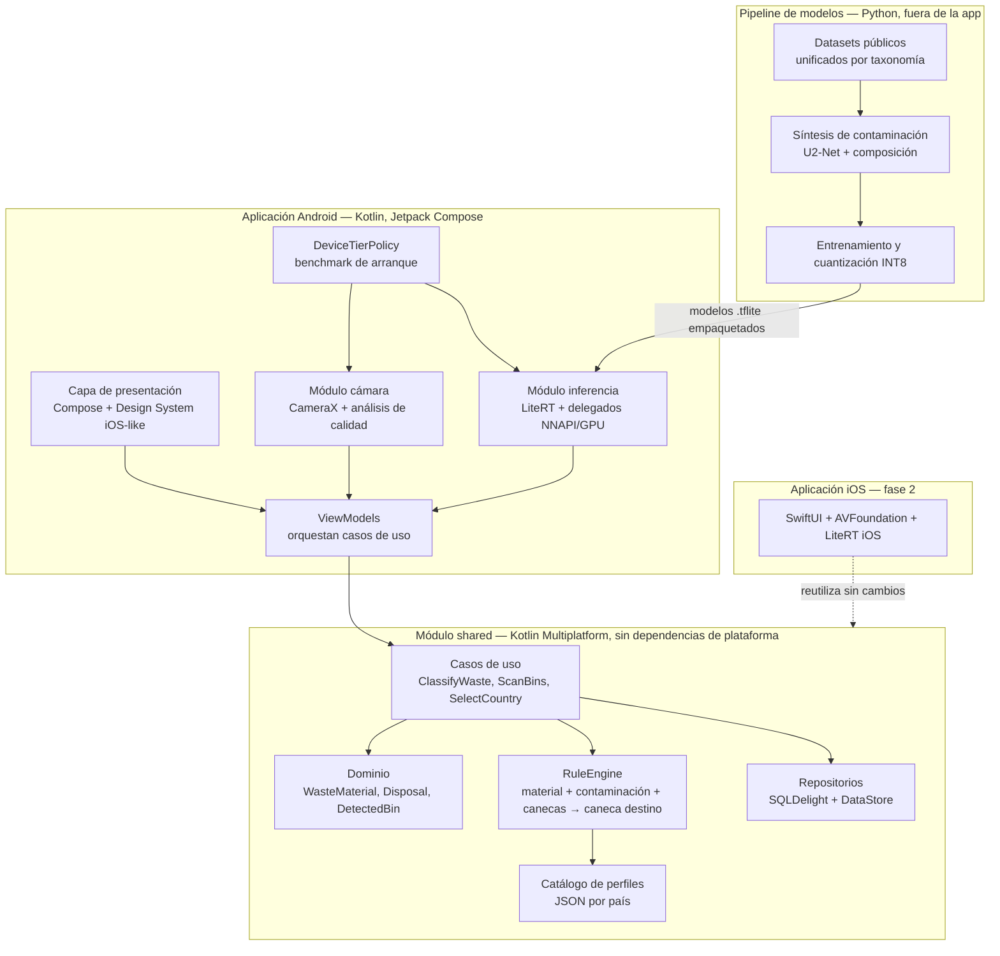
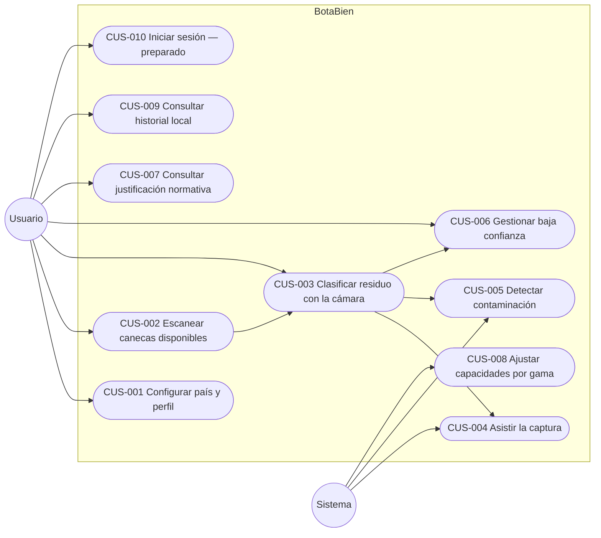
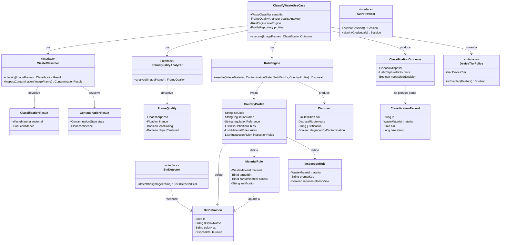
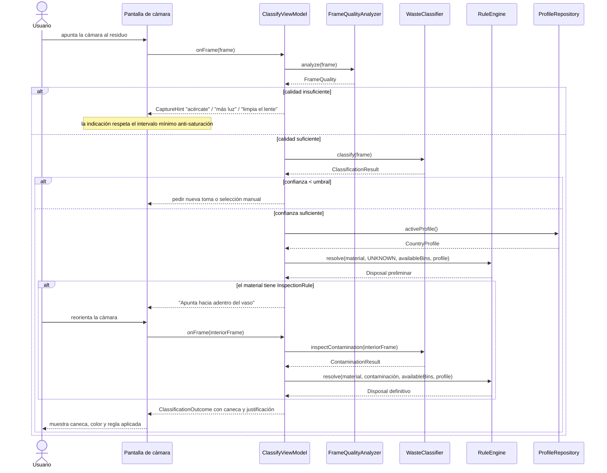
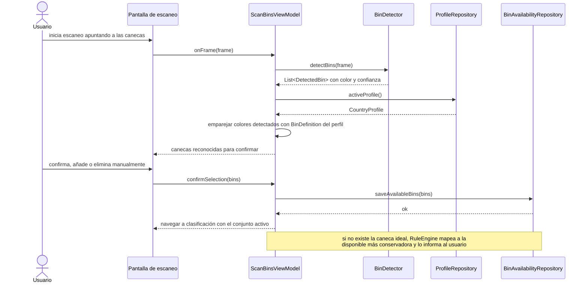
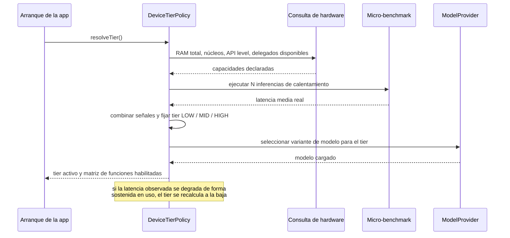
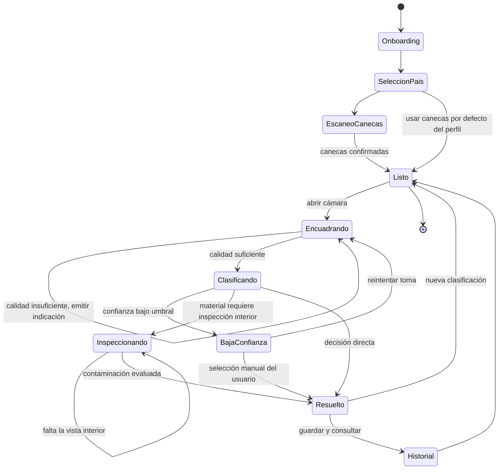

# Arquitectura — BotaBien

## Visión general

BotaBien es una aplicación móvil de clasificación de residuos que ejecuta toda su inteligencia en el dispositivo. La cámara alimenta un pipeline de dos etapas: una red clasifica el material del residuo y una segunda inspecciona contaminación. El resultado del modelo nunca es una caneca: es un material con su confianza. La traducción material a caneca la hace un motor de reglas que consume un perfil normativo intercambiable por país, lo que permite escalar a otras normativas sin tocar los modelos ni el código.

La aplicación se estructura en Kotlin Multiplatform con un módulo `shared` que no conoce ninguna plataforma. Ahí viven el dominio, el motor de reglas, los perfiles y la persistencia. Cámara, inferencia e interfaz son específicas de cada plataforma y se conectan al dominio mediante puertos. Esta separación es lo que hace que la fase iOS sea una implementación de adaptadores y no una reescritura.

## Casos de uso

| Identificador | Nombre |
|---|---|
| CUS-001 | Configurar país y perfil de clasificación |
| CUS-002 | Escanear y registrar las canecas disponibles |
| CUS-003 | Clasificar un residuo mediante la cámara |
| CUS-004 | Asistir la captura ante condiciones adversas |
| CUS-005 | Detectar contaminación en residuos aprovechables |
| CUS-006 | Gestionar resultados de baja confianza |
| CUS-007 | Consultar la justificación normativa del resultado |
| CUS-008 | Ajustar capacidades según la gama del dispositivo |
| CUS-009 | Consultar el historial local de clasificaciones |
| CUS-010 | Iniciar sesión — módulo preparado para versión futura |

## Modelo de dominio

### Notas de diseño

`WasteMaterial` es un enumerado cerrado que constituye el vocabulario compartido entre el modelo entrenado y el motor de reglas. Es el único punto de acoplamiento entre ambos mundos: si se añade un material, se añade en la taxonomía de `ml/` y en el enumerado, y se actualizan los perfiles que quieran contemplarlo. Un perfil que no declare regla para un material cae en una ruta por defecto declarada en el propio perfil, nunca en una decisión cableada en código.

`DisposalRoute` modela la ruta de disposición con independencia del color: `RECYCLABLE`, `NON_RECYCLABLE`, `ORGANIC`, `HAZARDOUS`, `SPECIAL_COLLECTION`. El color y el nombre visible salen de `BinDefinition`, que sí es específico del país. Esta separación permite que la métrica de exactitud que realmente importa —acertar la ruta— sea independiente de cómo cada país pinte sus canecas.

`contaminatedFallback` en `MaterialRule` es la pieza que resuelve el caso del vaso de café: la regla declara que el cartón para bebidas va a la caneca blanca si está limpio y a la negra si está contaminado, y esa decisión es dato del perfil, no lógica del clasificador.

## Flujos principales

### CUS-003 y CUS-005 — Clasificación con inspección de contaminación

### CUS-002 — Escaneo de canecas disponibles

### CUS-008 — Determinación de la gama del dispositivo

## Estados

### Máquina de estados de la sesión de clasificación

## Decisiones de arquitectura

| Decisión | Alternativas descartadas | Razón |
|---|---|---|
| Kotlin Multiplatform con `shared` sin dependencias de plataforma | Kotlin nativo puro; Flutter; React Native | Nativo puro obligaría a reescribir el motor de reglas en Swift, duplicando la fuente de verdad crítica. Flutter empujaría cámara e inferencia a platform channels justo en la ruta de latencia, con plugins de terceros sobre los delegados de aceleración. KMP comparte el dominio y deja nativo lo que debe serlo. |
| UI nativa por plataforma en vez de Compose Multiplatform | Compose Multiplatform para iOS | El objetivo estético es que cada plataforma se sienta propia. Compartir UI ahorraría código a costa de un iOS que no se siente iOS, que es precisamente lo que el producto quiere evitar. |
| Pipeline de dos etapas: material y luego contaminación | Clasificador único con clases "limpio/sucio" por material | Multiplicaría las clases y exigiría datos etiquetados por combinación. La evidencia publicada muestra que el enfoque de dos etapas corrige casi todos los casos contaminados que un clasificador base falla. Además permite ejecutar la segunda etapa solo cuando la regla lo pide, que es clave en gama baja. |
| El modelo predice materiales; las canecas salen de un motor de reglas | Entrenar un modelo por país; cablear el mapeo en la app | Un modelo por país es insostenible y exige reentrenar para escalar. Cablear el mapeo rompe el requisito de escalabilidad. Con perfiles en datos, un país nuevo es un archivo JSON. |
| Perfiles normativos como JSON versionado en recursos | Base de datos remota de reglas; constantes en código | La app debe funcionar sin conexión. JSON en recursos es offline por construcción, legible, revisable en un PR y actualizable sin migraciones. |
| LiteRT con delegados NNAPI y GPU | ONNX Runtime Mobile; MediaPipe; PyTorch Mobile | LiteRT tiene el mejor soporte de cuantización INT8 y de aceleración por hardware en el rango de dispositivos objetivo, y la ruta a iOS está cubierta. MediaPipe se evalúa solo para el detector de objeto. |
| Análisis de calidad de imagen con heurísticas, no con ML | Un modelo de calidad de imagen dedicado | Varianza del Laplaciano para nitidez, luminancia media para iluminación y diferencia entre frames para suciedad del lente son baratas, deterministas y explicables. Un modelo extra consumiría el presupuesto de latencia que necesita la clasificación. |
| Gama de dispositivo resuelta con benchmark de arranque | Lista de dispositivos; solo RAM y API level | Las listas envejecen y la RAM sola engaña. Medir la latencia real en el dispositivo concreto es la única señal que no miente. |
| Contaminación sintética a partir de datasets públicos | Recolección y etiquetado manual de dataset propio | No existe dataset público de reciclables contaminados y la recolección manual está descartada por el proyecto. La síntesis por segmentación y composición es la única vía viable. |
| Autenticación como interfaz con implementación invitado | Integrar Supabase o Firebase en v1 | La v1 es una demo sin backend. Definir el puerto ahora evita que la lógica de sesión se filtre por la app cuando llegue el backend real. |

## Reglas para no romper la arquitectura

1. `shared/` no importa nunca `android.*`, `androidx.*` ni el runtime de inferencia. Toda capacidad de plataforma entra por un puerto declarado en `shared/domain/port/`.
2. La conversión de material a caneca ocurre exclusivamente en `RuleEngine`. Ni el clasificador, ni la UI, ni los repositorios pueden decidir una caneca.
3. Ningún comportamiento se condiciona por país dentro del código. Lo específico de un país vive en su archivo de perfil.
4. La UI no llama a `inference/` ni a `data/`: pasa por un caso de uso.
5. Antes de activar cualquier función costosa se consulta `DeviceTierPolicy`. Nadie asume aceleración por hardware.
6. Los frames de cámara no se persisten, no se envían y no se registran en logs.
7. La ruta de clasificación no tiene ninguna dependencia de red. La app entera debe funcionar en modo avión.
8. Las interfaces de la sección "Contratos entre agentes" de `context-for-vibe-coding.md` son inmutables una vez fijadas en M0; cambiarlas requiere issue propia.
9. La exactitud se reporta siempre sobre un dataset no visto en entrenamiento, y siempre incluye el acierto de ruta además del top-1 de material.
